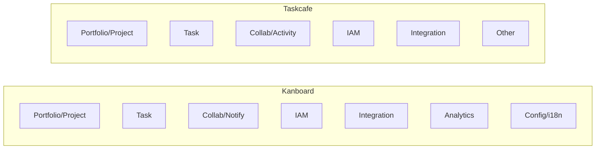

# Kanboard vs Taskcafe 

This document compares business capabilities (TOGAF 10 L1–L3) of Kanboard and Taskcafe.

Summary highlights
- Both provide core Kanban-based Task Management and Collaboration.
- Kanboard is mature, PHP-based, rich in analytics/time tracking, and granular IAM.
- Taskcafe is modern, Go/TypeScript, GraphQL-first, with personal views and due date notifications.

L1–L3 capability comparison (abridged)
- Portfolio & Project Management
  - Kanboard: Board workflow (Columns/Swimlanes/Transitions), project roles/permissions, duplication/templates.
  - Taskcafe: Projects/TaskGroups, team roles (Admin/Member), personal projects & My Tasks.
- Task Management
  - Kanboard: CRUD, move/reorder, subtasks, recurrence, priority, tags, attachments, time tracking.
  - Taskcafe: CRUD, move/sort, labels, checklists, comments in attributes, due date notifications; no built-in time tracking.
- Collaboration & Notification
  - Kanboard: comments, notifications (types/filters), activity.
  - Taskcafe: comments, activity feed; due date notifications on tasks.
- IAM
  - Kanboard: users, groups, project roles, permissions, password reset, user locking.
  - Taskcafe: users, per-project RBAC (Admin/Member), simpler scope.
- Integration & API
  - Kanboard: REST/JSON-RPC API, external link providers, plugins, import/export.
  - Taskcafe: GraphQL API, React SPA frontend; fewer integrations visible.
- Analytics & Reporting
  - Kanboard: board/column/task stats, daily stats, transition analytics.
  - Taskcafe: activity feed; no explicit analytics modules found.
- Configuration & Localization
  - Kanboard: settings, themes, language/timezone/currency.
  - Taskcafe: TOML config, Docker; i18n not prominent.

Mermaid – side-by-side capability overview

TOGAF alignment & recommendations
- Use capability heat-maps to assess maturity/effectiveness: time tracking (Kanboard), due date notifications (Taskcafe), IAM breadth.
- Map capabilities to value streams (e.g., "Plan & Deliver Work"): identify which repo capabilities enable each stage.
- For convergence: add analytics/time tracking to Taskcafe; add personal views to Kanboard; consider GraphQL layer or OpenAPI for modern integration.
