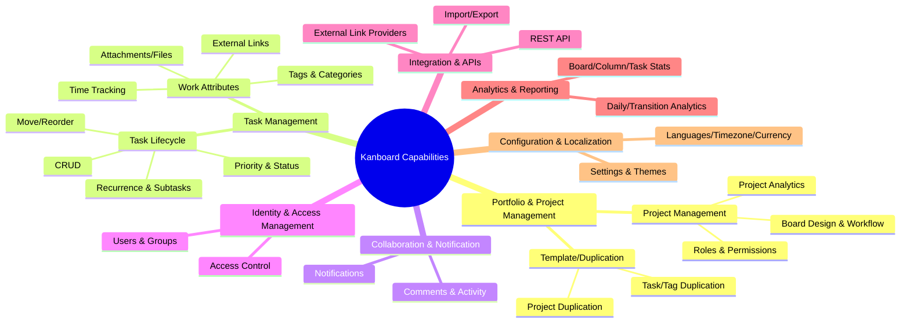

# Kanboard business capabilities (TOGAF 10 L1–L3)

Overview
- Repository: https://github.com/kanboard/kanboard
- Primary language: PHP (backend MVC); also JS/CSS for UI
- Domain: Project/Task management using Kanban methodology

L1–L3 capability map
- Portfolio & Project Management (L1)
  - Project Management (L2)
    - Board Design & Workflow (L3): Columns, Swimlanes, Transitions, WIP limits
    - Project Roles & Permissions (L3)
    - Project Analytics (L3)
  - Template/Duplication (L2)
    - Project Duplication (L3)
    - Task/Tag Duplication (L3)
- Task Management (L1)
  - Task Lifecycle (L2)
    - Create/Read/Update/Delete (L3)
    - Move/Reorder/Position (L3)
    - Recurrence & Subtasks (L3)
    - Priority & Status (L3)
  - Work Attributes (L2)
    - Tags & Categories (L3)
    - Attachments/Files (L3)
    - External Links (L3)
    - Time Tracking (L3)
- Collaboration & Notification (L1)
  - Comments & Activity (L2)
    - Comments CRUD (L3)
    - Project/Task Activity (L3)
  - Notifications (L2)
    - Notification Types/Channels (L3)
    - User Notification Filters (L3)
- Identity & Access Management (L1)
  - Users & Groups (L2)
    - User Profiles/Avatars (L3)
    - Group Membership (L3)
  - Access Control (L2)
    - Project Roles/Permissions (L3)
    - User Locking/Password Reset (L3)
- Integration & APIs (L1)
  - REST/JSON-RPC API (L2)
  - External Link Providers (L2)
  - Import/Export (L2)
- Analytics & Reporting (L1)
  - Board/Column/Task Statistics (L2)
  - Daily/Transition Analytics (L2)
- Configuration & Localization (L1)
  - Settings & Themes (L2)
  - Languages & Timezones & Currency (L2)

Evidence mapping to source (illustrative)
- Project/Board workflow: app/Model/{BoardModel.php, ColumnModel.php, SwimlaneModel.php, TransitionModel.php}
- Task lifecycle: app/Model/{TaskModel.php, TaskCreationModel.php, TaskModificationModel.php, TaskPositionModel.php, TaskRecurrenceModel.php, SubtaskModel.php}
- Work attributes: app/Model/{TagModel.php, TaskTagModel.php, CategoryModel.php, FileModel.php, TaskFileModel.php, TaskExternalLinkModel.php}
- Collaboration: app/Model/{CommentModel.php, ProjectActivityModel.php}
- Notifications: app/Model/{NotificationModel.php, NotificationTypeModel.php, UserNotificationModel.php, UserNotificationTypeModel.php, UserUnreadNotificationModel.php, UserNotificationFilterModel.php}
- IAM: app/Model/{UserModel.php, GroupModel.php, GroupMemberModel.php, ProjectUserRoleModel.php, ProjectGroupRoleModel.php, ProjectPermissionModel.php, UserLockingModel.php, PasswordResetModel.php}
- Analytics: app/Analytic/*, app/Model/{ProjectDailyStatsModel.php, ProjectDailyColumnStatsModel.php, TaskAnalyticModel.php}
- Configuration & i18n: app/Model/{SettingModel.php, ThemeModel.php, LanguageModel.php, TimezoneModel.php, CurrencyModel.php}, app/Locale/*
- Integration/API: app/Api/*, app/ExternalLink/*, app/Import/*, app/Export/*

TOGAF alignment notes
- Stable “what” view: capabilities are named noun–verb and remain stable despite org or tech changes (e.g., Task Management > Time Tracking).
- Capability components:
  - People: end-users, project admins, group admins
  - Processes: e.g., move task across columns, configure WIP limits, review analytics
  - Information: task, subtask, project, comment, tag, file, transition, time entry
  - Resources: PHP application, database, plugins, REST API
- Heat-mapping candidates: Task Time Tracking, Notifications, Analytics for performance/effectiveness; External Links for maturity.

Strengths and gaps (summary)
- Strengths: rich core Kanban features; fine-grained project-level IAM; built-in analytics; stable plugin ecosystem.
- Gaps/risks: maintenance mode (limited net-new features); UI/UX is classic server-rendered; no GraphQL; limited “My Tasks” cross-project personal views compared to modern tools.

Mermaid – Kanboard capability map

