# Kanboard business capabilities TOGAF 10 L1–L3

## Overview
- Repository: https://github.com/kanboard/kanboard
- Primary language: PHP
- Domain: Project management Kanban board

## L1–L3 capability map
- Work management
  - Project management
    - Project lifecycle
      - Evidence: app/Controller ProjectCreationController.php ProjectEditController.php ProjectStatusController.php
    - Roles and permissions
      - Evidence: app/Model ProjectPermissionModel.php ProjectRoleModel.php ProjectRoleRestrictionModel.php
  - Board management
    - Columns and swimlanes
      - Evidence: app/Model ColumnModel.php SwimlaneModel.php Controller ColumnController.php SwimlaneController.php
    - Board view and interactions
      - Evidence: app/Controller BoardViewController.php BoardAjaxController.php BoardTooltipController.php
  - Task management
    - Task creation and modification
      - Evidence: app/Model TaskCreationModel.php TaskModificationModel.php Controller TaskCreationController.php TaskModificationController.php
    - Subtasks
      - Evidence: app/Model SubtaskModel.php SubtaskStatusModel.php Controller SubtaskController.php
    - Task links and dependencies
      - Evidence: app/Model TaskLinkModel.php TaskInternalLinkController.php TaskExternalLinkModel.php
    - Files and attachments
      - Evidence: app/Model FileModel.php TaskFileModel.php Controller FileViewerController.php TaskFileController.php
    - Recurrence and automation
      - Evidence: app/Model TaskRecurrenceModel.php ActionModel.php ActionController.php
    - Tags and categories
      - Evidence: app/Model TagModel.php CategoryModel.php Controller ProjectTagController.php CategoryController.php
    - Comments and activity
      - Evidence: app/Model CommentModel.php Controller CommentController.php ActivityController.php
    - Search and filters
      - Evidence: app/Filter CustomFilterModel.php Controller SearchController.php CustomFilterController.php
- Collaboration and communication
  - Notifications
    - Email and web notifications
      - Evidence: app/Model NotificationModel.php NotificationTypeModel.php UserNotificationModel.php WebNotificationController.php TaskMailController.php CommentMailController.php
  - Feeds
    - Evidence: app/Controller FeedController.php
- Analytics and reporting
  - Analytics views
    - Evidence: app/Analytic AnalyticController.php TaskAnalyticModel.php ProjectDailyStatsModel.php ProjectDailyColumnStatsModel.php
  - Export
    - Evidence: app/Export ExportController.php
- User and access management
  - Authentication
    - Local auth two factor captcha OAuth
      - Evidence: app/Auth app/Controller AuthController.php TwoFactorController.php OAuthController.php CaptchaController.php CaptchaModel.php
  - User management
    - Users groups invitations
      - Evidence: app/Model UserModel.php GroupModel.php GroupMemberModel.php InviteModel.php Controllers GroupCreationController.php GroupListController.php UserInviteController.php
  - Authorization
    - Project permissions and restrictions
      - Evidence: app/Model ProjectPermissionModel.php ProjectRoleRestrictionModel.php ColumnRestrictionModel.php ColumnMoveRestrictionModel.php
- Integration and extensibility
  - API and plugins
    - Evidence: app/Api jsonrpc.php Controller PluginController.php
  - External links
    - Evidence: app/ExternalLink TaskExternalLinkModel.php
- System administration
  - Configuration and settings
    - Evidence: config.default.php SettingModel.php ConfigController.php
  - Localization theming timezone
    - Evidence: app/Locale LanguageModel.php ThemeModel.php TimezoneModel.php
  - Files and storage
    - Evidence: FileModel.php AvatarFileModel.php ProjectFileModel.php
- Platform services
  - Jobs pagination middleware
    - Evidence: app/Job app/Pagination app/Middleware
- Data management
  - Schema and migrations
    - Evidence: app/Schema

## Capability map

```mermaid
flowchart TB
  A[Work management] --> A1[Project management]
  A1 --> A1a[Project lifecycle]
  A1 --> A1b[Roles and permissions]
  A --> A2[Board management]
  A2 --> A2a[Columns and swimlanes]
  A2 --> A2b[Board view and interactions]
  A --> A3[Task management]
  A3 --> A3a[Task creation and modification]
  A3 --> A3b[Subtasks]
  A3 --> A3c[Task links and dependencies]
  A3 --> A3d[Files and attachments]
  A3 --> A3e[Recurrence and automation]
  A3 --> A3f[Tags and categories]
  A3 --> A3g[Comments and activity]
  A3 --> A3h[Search and filters]
  B[Collaboration and communication] --> B1[Notifications]
  B1 --> B1a[Email and web notifications]
  B --> B2[Feeds]
  C[Analytics and reporting] --> C1[Analytics views]
  C --> C2[Export]
  D[User and access management] --> D1[Authentication]
  D1 --> D1a[Local auth]
  D1 --> D1b[Two factor]
  D1 --> D1c[Captcha]
  D1 --> D1d[OAuth]
  D --> D2[User management]
  D2 --> D2a[Users]
  D2 --> D2b[Groups]
  D2 --> D2c[Invitations]
  D --> D3[Authorization]
  D3 --> D3a[Project permissions]
  D3 --> D3b[Restrictions]
  E[Integration and extensibility] --> E1[API]
  E --> E2[Plugins]
  E --> E3[External links]
  F[System administration] --> F1[Configuration and settings]
  F --> F2[Localization theming timezone]
  F --> F3[Files and storage]
  G[Platform services] --> G1[Jobs]
  G --> G2[Pagination]
  G --> G3[Middleware]
  H[Data management] --> H1[Schema and migrations]
```

