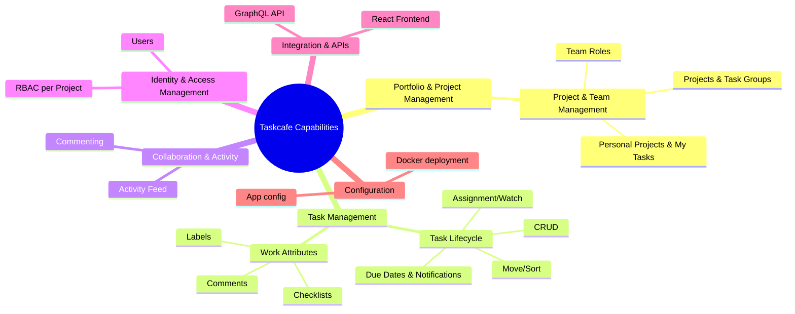

# Taskcafe business capabilities (TOGAF 10 L1–L3)

Overview
- Repository: https://github.com/JordanKnott/taskcafe
- Primary language: TypeScript (React UI) + Go (GraphQL backend)
- Domain: Kanban-style project/task management; alpha status

L1–L3 capability map
- Portfolio & Project Management (L1)
  - Project & Team Management (L2)
    - Projects & Task Groups (L3)
    - Team Roles (Admin/Member) (L3)
    - Personal Projects & My Tasks (L3)
- Task Management (L1)
  - Task Lifecycle (L2)
    - Create/Read/Update/Delete (L3)
    - Move across TaskGroups, Sort (L3)
    - Assign/Unassign, Watch (L3)
    - Due Dates & Notifications (L3)
  - Work Attributes (L2)
    - Labels (L3)
    - Checklists (L3)
    - Comments (L3)
- Collaboration & Activity (L1)
  - Commenting (L2)
  - Activity Feed (L2)
- Identity & Access Management (L1)
  - Users (L2)
  - RBAC per Project (Admin/Member) (L2)
- Integration & APIs (L1)
  - GraphQL API (L2)
  - React SPA Frontend (L2)
- Configuration (L1)
  - App config (TOML), Docker deployment (L2)

Evidence mapping to source (illustrative)
- GraphQL schema (capability surface): internal/graph/schema/*.gql (e.g., task.gql, project.gql, team.gql, user.gql)
- Resolvers (process realization): internal/graph/*resolvers.go implement mutations/queries for tasks, groups, teams, users
- Task capabilities: internal/graph/schema/task.gql defines Task, checklists, comments, labels, due date notifications, assignment
- Project & team: internal/graph/schema/project.gql, team.gql; resolvers project.resolvers.go, team.resolvers.go
- RBAC: @hasRole directives in schema; enforced in resolvers

TOGAF alignment notes
- Capabilities named as noun–verb/grouped by L1–L3, stable across tech choices.
- Capability components:
  - People: project admins, members, end users
  - Processes: create task, move/sort, assign, manage labels/checklists, comment, manage due date notifications
  - Information: project, task, task group, comment, label, checklist, notification
  - Resources: Go backend with GraphQL, Postgres, React frontend, Docker
- Heat-mapping candidates: Due Date Notifications, Activity Feed maturity, My Tasks breadth, Team management depth.

Strengths and gaps (summary)
- Strengths: modern GraphQL API; rich task attributes (labels, checklists, due date notifications); personal views (My Tasks); React UI.
- Gaps/risks: alpha status; fewer enterprise IAM features vs. Kanboard (groups, granular roles); analytics/time-tracking not first-class; ecosystem smaller.

Mermaid – Taskcafe capability map

