# Taskcafe business capabilities TOGAF 10 L1–L3

## Overview
- Repository: https://github.com/JordanKnott/taskcafe
- Primary language: TypeScript frontend Go backend
- Domain: Project management Kanban board

## L1–L3 capability map
- Work management
  - Project management
    - Project lifecycle and overview
      - Evidence: internal/graph project.resolvers.go schema project.gql frontend/src/Projects
    - Team based projects and roles
      - Evidence: internal/graph team.resolvers.go internal/db team.sql.go team_member.sql.go
  - Board management
    - Task lists columns and board view
      - Evidence: internal/graph taskList.resolvers.go frontend/src/Projects internal/db task_group.sql.go
    - Labels and colors
      - Evidence: internal/db project_label.sql.go label_color.sql.go
  - Task management
    - Task creation and modification
      - Evidence: internal/graph task.resolvers.go internal/db task.sql.go
    - Checklists and subtasks
      - Evidence: internal/db task_checklist.sql.go internal/graph task.resolvers.go
    - Assignments due dates activity
      - Evidence: internal/db task_assigned.sql.go task_activity.sql.go internal/graph task.resolvers.go
    - Comments and notifications
      - Evidence: internal/graph notification.resolvers.go internal/db notification.sql.go
    - Tags labels and search
      - Evidence: internal/db task_label.sql.go project_label.sql.go schema task.gql
  - Personal productivity
    - My tasks view
      - Evidence: frontend/src/MyTasks internal/graph user.resolvers.go
- Collaboration and communication
  - Notifications
    - In app notifications
      - Evidence: internal/graph notification.resolvers.go internal/db notification.sql.go
  - Team management
    - Members invitations and roles
      - Evidence: internal/graph team.resolvers.go internal/db team_member.sql.go
- Analytics and reporting
  - Activity streams
    - Evidence: internal/db task_activity.sql.go internal/graph project.resolvers.go
- User and access management
  - Authentication
    - Local auth and sessions
      - Evidence: internal/route auth.go internal/db user_accounts.sql.go
  - User profile and settings
    - Evidence: frontend/src/Profile internal/graph user.resolvers.go internal/route settings.go
  - Authorization
    - Tokens and API access
      - Evidence: internal/commands token.go internal/db token.sql.go
- Integration and extensibility
  - GraphQL API schema
    - Evidence: internal/graph schema schema.gql project.gql task.gql user.gql team.gql
  - Web routes middleware
    - Evidence: internal/route route.go middleware.go
- System administration
  - Configuration and options
    - Evidence: conf app.example.toml internal/db system_options.sql.go
  - Migrations and seeding
    - Evidence: internal/commands migrate.go seed.go migrations
  - Jobs and workers
    - Evidence: internal/commands job.go worker.go internal/jobs
- Platform services
  - Logging and utilities
    - Evidence: internal/logger internal/utils internal/route log.go
  - Repository and database access
    - Evidence: internal/db repository.go db.go querier.go

## Capability map

```mermaid
flowchart TB
  A[Work management] --> A1[Project management]
  A1 --> A1a[Project lifecycle and overview]
  A1 --> A1b[Team based projects and roles]
  A --> A2[Board management]
  A2 --> A2a[Task lists columns and board view]
  A2 --> A2b[Labels and colors]
  A --> A3[Task management]
  A3 --> A3a[Task creation and modification]
  A3 --> A3b[Checklists and subtasks]
  A3 --> A3c[Assignments due dates activity]
  A3 --> A3d[Comments and notifications]
  A3 --> A3e[Tags labels and search]
  A --> A4[Personal productivity]
  A4 --> A4a[My tasks view]
  B[Collaboration and communication] --> B1[Notifications]
  B1 --> B1a[In app notifications]
  B --> B2[Team management]
  B2 --> B2a[Members invitations and roles]
  C[Analytics and reporting] --> C1[Activity streams]
  D[User and access management] --> D1[Authentication]
  D1 --> D1a[Local auth and sessions]
  D --> D2[User profile and settings]
  D --> D3[Authorization]
  D3 --> D3a[Tokens and API access]
  E[Integration and extensibility] --> E1[GraphQL API schema]
  E --> E2[Web routes middleware]
  F[System administration] --> F1[Configuration and options]
  F --> F2[Migrations and seeding]
  F --> F3[Jobs and workers]
  G[Platform services] --> G1[Logging and utilities]
  G --> G2[Repository and database access]
```

